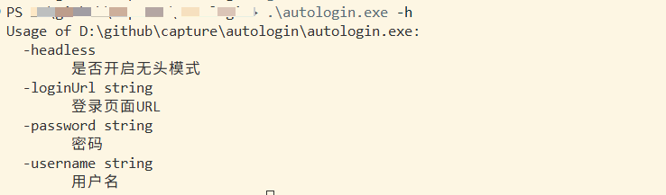
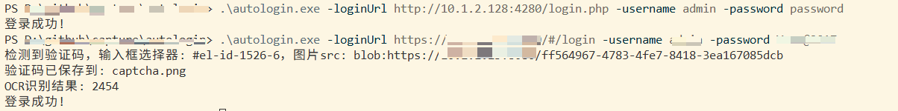

## 自动登录

兼容大部分登录页面：有无验证码登录均可，无需手动干预





> 默认是不开启无头模式的，会有浏览器窗口弹出，便于调试和观测自动登录的整个过程
## 安装

```
git clone https://github.com/dusbot/autologin.git
```

前置：python3(python 二进制最好设置别名为 python)、pip3

```bash
cd ddddocr_server
pip3 install -r requirements.txt
```

## 编译

```bash
go build -trimpath -ldflags "-s -w"
```

## 运行

1. 程序默认会自动去当前路径去运行 ddddocr_server/app/main.py，所以编译后的二进制需要和 ddddocr_server 在同一目录下

```bash
./autologin -loginUrl $your_login_url -username $your_username -password $your_password
```

2. 也可以先提前手动运行 ddddocr_server/app/main.py，然后再运行 autologin

```bash
python ddddocr_server/app/main.py
```
